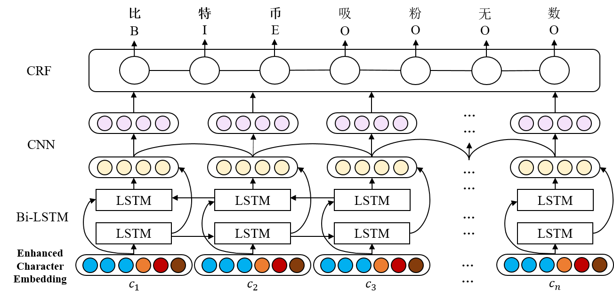
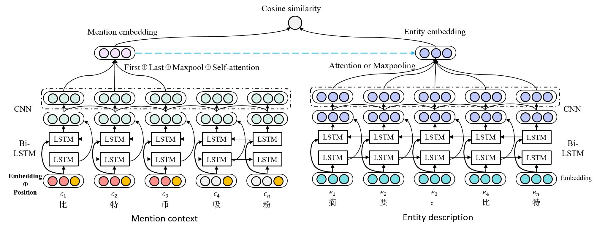

# Enhanced Character Embedding for Chinese Short Text Entity Linking

## 目录  
<!-- TOC -->
- [详细设计](#详细设计)
  - [整体设计思路](#整体设计思路)
  - [实体识别](#实体识别)
  - [实体消歧](#实体消歧)
  - [集成](#集成)
- [项目配置与运行](#项目配置与运行)
  - [数据准备](#数据准备)
  - [环境准备](#环境准备)
  - [训练](#训练)
  - [预测](#预测)
<!-- /TOC -->
  
## 详细设计  
### 整体设计思路
本次比赛我使用的是pipeline的方式解决实体链接问题，即先进行实体识别，而后进行实体消歧。由于中文缺少显式的词语分割符，基于词序列的实体链接容易受分词错误影响。但基于字序列的实体识别又无法充分利用句子中单词的语义信息。因此本次比赛的整体设计思路是在子序列输入的基础上，加入额外的信息增强字的语义表达，即使用enhanced character embedding解决中文短文本实体链接问题。具体而言，对于实体识别，由于要求所识别的实体必须在知识库中的mention库出现，所以考虑加入mention库匹配信息；而对于实体消歧，在同一文本中出现的不同mention的representation应该不同，因此考虑加入mention的位置信息。

### 实体识别  

实体识别采用经典的BiLSTM-CNN-CRF序列标注模型，输出使用BIOES标注。而在输入层上，我们使用字向量序列作为基础输入，并在此基础上拼接一系列具有丰富语义信息，有助于识别实体mention边界的embedding。拼接的embedding主要有：

- **c2v**  
使用word2vec的方法对训练语料的子序列进行训练，得到300维的字向量。这是实体识别模型的基础输入。  

- **bert***    
从在大规模语料上训练的预训练语言模型，如 [bert](https://github.com/google-research/bert)，[ernie](https://github.com/ArthurRizar/tensorflow_ernie)，[bert_wwm](https://github.com/ymcui/Chinese-BERT-wwm) 也可以得到768维的字向量。 

- **bic2v**    
邻接字bigram向量。将训练语料切成bigram字序列，如句子 `“比特币吸粉无数”` 会被切成序列：`['比特', '特币', '币吸', '吸粉', '粉无', '无数']`，然后使用word2vec的方法进行训练得到50维的邻接字bigram向量。  

- 间接引入mention库匹配信息的embedding    
我们将`kb_data`中所有的alias词典（即mention库）视为用户词典，导入jieba后对文本进行分词，这样能最大程度保证mention作为一个完整的词被分出来，然后我们加入以下特征：  
  - **w2v@c**  
  字符所在词向量。我们先使用word2vec的方法对训练语料的词序列进行训练，得到300维的词向量。然后我们为每个字都拼接上其所在的词的词向量，这样来自同一个mention的字都具有相同的mention向量，便于实体识别。
  
  - **cp**    
  字符所在词的位置特征向量。我们使用BMES标记字符的位置。如句子 `“比特币吸粉无数”` 被jieba切成的词序列为：`['比特币', '吸粉', '无数']`，则字符的位置信息将会被标注为`[B, M, E, B, E, B, E]`。我们为这四个标记分别随机初始化一个50维向量，然后在模型训练时fine-tune。
  
  - **cp2v**  
  位置感知的字符向量。将子序列与对应的位置标注序列结合，如上例 `“比特币吸粉无数”` 将会得到序列：`['比B', '特M', '币E', '吸B', '粉E', '无B', '数E']`，我们使用word2vec的方法对这些加入了位置信息的字序列进行训练，得到位置感知的字符向量。  
  
- 直接引入mention库匹配信息的embedding
  - **ngram-match**  
  ngram匹配特征向量。我们将以每个字为首（尾）的bi-gram，tri-gram，4-gram等与mention库进行匹配，得到one-hot向量。如下图，考虑对“币”的n-gram，发现只有以“币”为尾的tri-gram“比特币”能够与mention库匹配。  
  - **max-match**  
  双向最大匹配特征向量。我们将mention库作为分词词典，使用双向最大匹配分词算法找出所有候选mention，如句子 `“比特币吸粉无数”` 会得到三个候选mention：`['比特币', '吸粉', '无数']`，然后我们使用BMEO标注（'O'表示不是mention）序列为`[B, M, E, B, E, B, E]`。。我们为这四个标记分别随机初始化一个50维向量，然后在模型训练时fine-tune。

### 实体消歧
  
实体消歧使用语义匹配的思路，我们使用待消歧文本以及知识库中候选实体所有三元组拼接起来的实体描述文本作为匹配文本对，使用神经网络对它们进行建模得到各自的 representation，然后使用 cosine 相似度进行匹配度打分，选择得分最高的候选实体输出。神经网络框架大体是Bi-LSTM+CNN（CNN可选），由于待消歧文本与候选实体描述文本的长度相差较大，我们没有使用孪生网络结构。下面重点讲解 mention embedding 和 entity embedding 如何生成。  

- mention embedding  
由于在同一文本中可能存在不同的mention，他们的representation也应该是不同的。如 `“唱歌的李娜和打网球的李娜是同一个人吗？”` 中的两个李娜对应着不同的实体，对它们的建模也应该不一样。因此我们考虑加入mention在文本的位置信息，主要有两种方法：
  - 首先，我们在字向量序列输入的基础上，拼接上每个字与mention的相对位置向量，以反映他们与mention距离上的紧密程度。相对位置向量一开始会被初始化成50维的向量，而后随着网络进行优化。
  - 经过BiLSTM+CNN后，我们只选取mention部分的输出序列来产生mention embedding。具体而言，我们将mention第一个字向量、最后一个字向量、maxpooling向量以及使用self-attention得到的向量进行拼接，最后通过一层简单的全连接层得到mention表达。

- entity embedding  
得到BiLSTM+CNN输出的隐藏向量序列后，我们尝试了两种方法得到entity embedding：
  - 对隐藏向量序列进行maxpooling，选择时间步最大的进行输出。
  - 利用mention embedding与隐藏向量序列进行attention计算，然后使用隐藏向量的加权和结果作为entity表达。我们主要尝试了3种attention权重的计算方式:  
    

- 训练细节  
训练实体消歧模型时，我们采用的的损失函数是 L(m, e<sub>+</sub>, e<sub>-</sub>) = max(m+score(m, e<sub>-</sub>)-score(m, e<sub>+</sub>), 0)，其中m是margin的意思，即正确实体与mention的匹配得分要比错误实体的匹配得分要至少高出一个margin大小。实验里我们设置margin为0.04。此外，我们为每个正确实体采样n个错误实体（即负样本），实验中我们发现n取4或5最佳。

### 集成  
为了提分，我们还采用了两种模型集成的方式。

- weight averaging  
在训练单模型的时候，但模型训练了一定的epoch之后，模型逐渐接近（局部）最优点。这时候我们复制一份模型的权重w<sub>a</sub>在内存中。当新的一轮迭代结束之后，会产生一份cinder模型权重w，然后我们按照以下公式更新w<sub>a</sub>：    从公式上我们可知，这种方法实际上便是对模型训练的最后次迭代产生的模型进行参数上的平均。这种方式产生的模型更加“平滑”，总是要比训练得到的最好模型更优。

- output averaging  
我们还尝试了对不同模型的输出取平均的方法进行集成。下面是关于实体实体与消歧的不同模型的设置：
  - 对于实体识别模型，我们对除了**c2v**向量外的embedding进行ablation实验发现它们的贡献程度是为 w2v@c>bert*>max_match>ngram_match>cp>>bic2v≈cp2v。因此考虑加或不加bic2v和cp2v 向量，以及使用何种预训练语言模型（3种），我们可以产生在输入特征上不同的实体识别模型。
  - 对于实体消歧模型，考虑是否添加相对位置向量，是否使用CNN，以及entity embedding的产生方式，我们也可以在模型结构上不同的实体消歧模型。
  
## 项目配置与运行

### 数据准备
- [训练数据，提取码：ye3d](https://pan.baidu.com/s/1gNTcM-EUeSMwCTWoYfq6gQ)  
解压后，文件夹名为`ccks2019_el`，放至`raw_data`目录下  

- [B榜测试数据，提取码：wb46](https://pan.baidu.com/s/1X_knNSLDgILCZW-AY1JeQg)  
下载后，文件名为`eval722.json`，放至`raw_data/ccks2019_el`目录下

- [bert](https://storage.googleapis.com/bert_models/2018_11_03/chinese_L-12_H-768_A-12.zip)  
解压后，文件夹名为`chinese_L-12_H-768_A-12`, 放至`raw_data/embeddings`目录下

- [ernie，提取码：iq74](https://pan.baidu.com/s/1I7kKVlZN6hl-sUbnvttJzA)  
解压后，文件夹名为`baidu_ernie`, 放至`raw_data/embeddings`目录下

- [bert_wwm](https://drive.google.com/file/d/1RoTQsXp2hkQ1gSRVylRIJfQxJUgkfJMW/view)  
解压后，修改文件夹名为`chinese_wwm_L-12_H-768_A-12`，放至`raw_data/embeddings`目录下

### 环境准备  
```python
pip install -r requirements.txt
```
### 训练

1. 预处理  
```python
python3 preprocess.py
```
2. 实体识别模型训练
```python
python3 train_er.py
```
3. 实体消歧模型训练
```python
python3 train_el.py
```

### 预测
```python
python3 ensemble.py
```
代码执行完毕后，会在`submit`目录生成`final_submit.json`。

